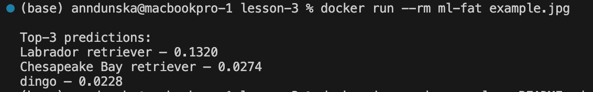
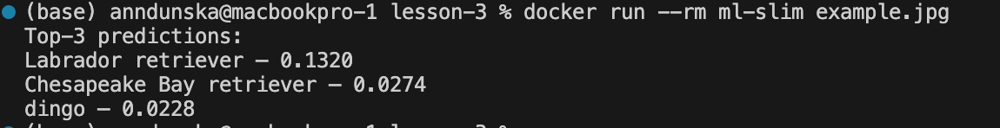

## Перевірка працездатності коду
### ml-fat

### ml-slim

## Порівняння Docker-образів

### Розміри образів
 - ml-fat:     2.73GB
 - ml-slim:    1.04GB

### Кількість шарів
 - ml-fat:        20
 - ml-slim:       15

### Присутність зайвих інструментів
 - ml-fat: містить зайві пакети (apt, build tools, pip-шари)
 - ml-slim: не містить зайвих інструментів у runtime

### Пропозиції з подальшої оптимізації
- Використати distroless-базовий образ для мінімального runtime та безпеки.
- Перейти на CPU-only збірку PyTorch, яка значно менша за розміром.
- Використати легші моделі (MobileNetV3-Small, SqueezeNet), щоб зменшити розмір model.pt.
- Використати TorchScript Lite або оптимізовану форму моделі.

